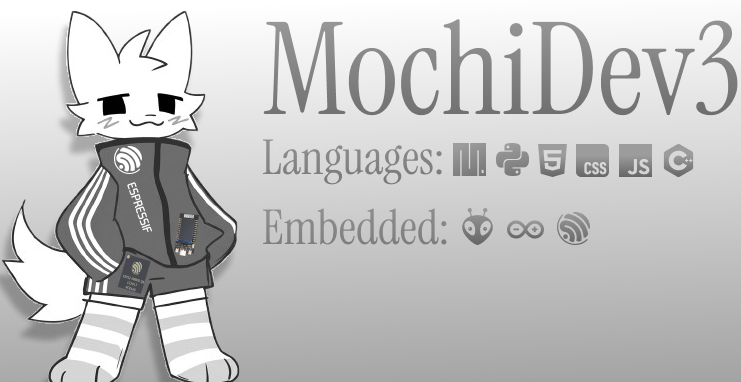

  

<h1 align="center">MochiDev3</h1>

  

---

### Tech Stack
* **Embedded:** ESP32 (TTGO T-Display), custom firmware, hardware prototyping.
* **Software:** Python, C++ for low-level systems.
* **OS:** Linux Bubuntu 24.04 LTS.

---

### Statistics

  
  

---

  <i>"I just want a quiet life."</i> — Yoshikage Kira

